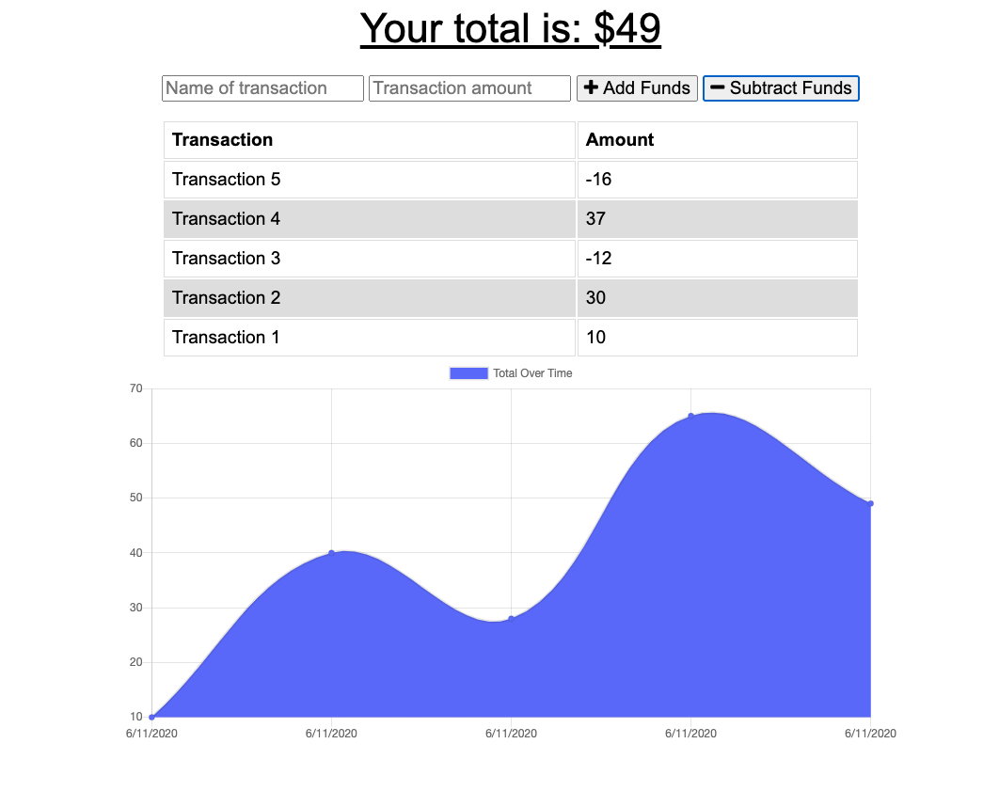

# Budget-Tracker

<svg xmlns="http://www.w3.org/2000/svg" xmlns:xlink="http://www.w3.org/1999/xlink" width="96" height="20"><linearGradient id="b" x2="0" y2="100%"><stop offset="0" stop-color="#bbb" stop-opacity=".1"/><stop offset="1" stop-opacity=".1"/></linearGradient><clipPath id="a"><rect width="96" height="20" rx="3" fill="#fff"/></clipPath><g clip-path="url(#a)"><path fill="#555" d="M0 0h79v20H0z"/><path fill="#97ca00" d="M79 0h17v20H79z"/><path fill="url(#b)" d="M0 0h96v20H0z"/></g><g fill="#fff" text-anchor="middle" font-family="DejaVu Sans,Verdana,Geneva,sans-serif" font-size="110"> <text x="405" y="150" fill="#010101" fill-opacity=".3" transform="scale(.1)" textLength="690"></text><text x="405" y="140" transform="scale(.1)" textLength="690">Version</text><text x="865" y="150" fill="#010101" fill-opacity=".3" transform="scale(.1)" textLength="70"></text><text x="865" y="140" transform="scale(.1)" textLength="160">1.0</text></g> </svg>

## Description

A budget tracker to create and track a personal budget.
Giving users a fast and easy way to track their money is important, but allowing them to access that information anytime is even more important. Having offline functionality is paramount to our applications success.

A user is able to add expenses and deposits to their budget with or without an internet connection thanks to a PWA. When entering transactions offline, they populate the total when brought back online.

Offline Functionality:

- Enter deposits offline

- Enter expenses offline

When brought back online:

- Offline entries should be added to tracker.

## Table of Contents

- [Description](#description)
- [Screenshot](#screenshot)
- [Installation](#installation)
- [Usage](#usage)
- [Authors and Acknowledgment](#authors-and-acknowledgment)
- [License](#license)

## Screenshot

## Installation

Clone the repo with the following command
`git clone https://github.com/DCRevResLabs/Budget-Tracker.git`
Run the following command to install all dependencies
`npm install`

## Usage

To execute the application use
`npm run start`

When the user loads the main page, they are given the option to create new transactions

The user is able to:

- Add or subtract funds.

- view all stored transactions.

- view stored transactions as a graph.

## Authors and Acknowledgment

### Main Author

[DCRevResLabs](https://github.com/DCRevResLabs)

## License

© 2020 Revolution Research Laboratories Pty.Ltd. All Rights Reserved.
